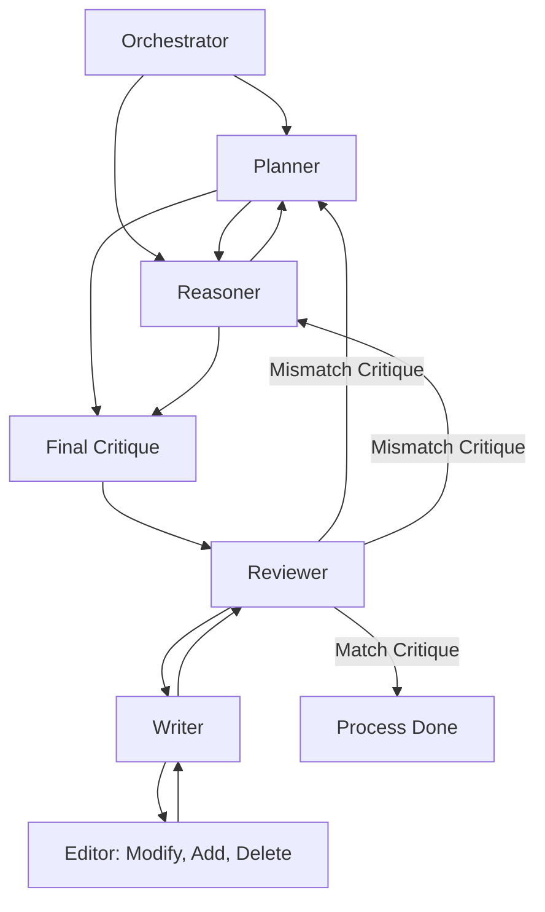

# Multi-Agent Orchestration Architecture
### Technical Documentation — Iterative Feedback Loop System

---

## Table of Contents

1. [High-Level Overview](#1-high-level-overview)
2. [Architecture Diagram](#2-architecture-diagram)
3. [Agent Definitions and Responsibilities](#3-agent-definitions-and-responsibilities)
   - 3.1 [Orchestrator](#31-orchestrator)
   - 3.2 [Planner](#32-planner)
   - 3.3 [Reasoner](#33-reasoner)
   - 3.4 [Reviewer](#34-reviewer)
   - 3.5 [Writer](#35-writer)
   - 3.6 [Editor (Sub-Agent of Writer)](#36-editor-sub-agent-of-writer)
4. [Interaction Sequences](#4-interaction-sequences)
   - 4.1 [Initialization Phase](#41-initialization-phase)
   - 4.2 [Planning and Reasoning Phase](#42-planning-and-reasoning-phase)
   - 4.3 [Final Critique Synthesis](#43-final-critique-synthesis)
   - 4.4 [Writing and Editing Phase](#44-writing-and-editing-phase)
   - 4.5 [Review and Decision Phase](#45-review-and-decision-phase)
5. [The Iterative Feedback Loop](#5-the-iterative-feedback-loop)
   - 5.1 [Loop Entry Conditions](#51-loop-entry-conditions)
   - 5.2 [Decision Points](#52-decision-points)
   - 5.3 [Termination Conditions](#53-termination-conditions)
6. [CrewAI Framework Mapping](#6-crewai-framework-mapping)
   - 6.1 [Role Mapping Table](#61-role-mapping-table)
   - 6.2 [CrewAI Concepts in Practice](#62-crewai-concepts-in-practice)
7. [Content Validation and Closure](#7-content-validation-and-closure)
8. [Error Handling and Edge Cases](#8-error-handling-and-edge-cases)
9. [Summary Flow Reference](#9-summary-flow-reference)

---

## 1. High-Level Overview

This document describes a **multi-agent orchestration system** built around a collaborative, self-correcting pipeline. The system is designed to produce high-quality content or analytical outputs by coordinating five specialized agents—each with a distinct cognitive role—within a controlled iterative loop.

The architecture is centered on a **feedback-driven quality assurance mechanism**: outputs are continuously evaluated against a pre-defined critique, revised, and resubmitted until a convergence condition is met. This mirrors peer-review processes in academic and editorial workflows, applied at machine speed and scale.

### Core Design Principles

| Principle | Description |
|---|---|
| **Separation of Concerns** | Each agent performs one well-defined function; no agent conflates planning with execution. |
| **Iterative Refinement** | Output quality improves progressively through structured critique cycles. |
| **Conditional Routing** | The Reviewer acts as a traffic controller, routing back to upstream agents on failure or forward to closure on success. |
| **Graceful Convergence** | The loop guarantees eventual termination by converging on a validated output or escalating to the Orchestrator. |

---

## 2. Architecture Diagram



> **Reading the diagram:** Arrows represent the flow of information or control signals between agents. Labels on arrows (e.g., `Match Critique`, `Mismatch Critique`) represent conditional routing decisions made by the Reviewer.

---

## 3. Agent Definitions and Responsibilities

### 3.1 Orchestrator

**Role:** System Coordinator / Entry Point

The Orchestrator is the top-level supervisor of the entire pipeline. It is responsible for initiating the workflow, providing the initial task specification, and managing the lifecycle of subordinate agents. It does not participate in content generation or evaluation directly.

**Responsibilities:**
- Receives and parses the incoming task or request.
- Dispatches initial context and directives to both the **Planner** and the **Reasoner** simultaneously.
- Monitors system-wide health (e.g., loop iteration counts, timeout thresholds).
- May intervene in the process if the system reaches a predefined stall condition (e.g., excessive mismatch cycles).
- Acts as the final escalation point if all other agents fail to converge.

**Inputs:** Raw task description, user goals, constraints, and quality benchmarks.  
**Outputs:** Structured task briefs dispatched to the Planner and Reasoner.

---

### 3.2 Planner

**Role:** Strategic Architect

The Planner translates high-level goals into a concrete, structured plan. It defines *what* needs to be done, *in what order*, and *to what standard*. The Planner collaborates bidirectionally with the Reasoner, refining the plan based on logical feasibility feedback.

**Responsibilities:**
- Breaks down the Orchestrator's directive into actionable sub-tasks.
- Defines success criteria and expected content characteristics.
- Engages in a collaborative back-and-forth with the Reasoner to stress-test the plan's logical coherence.
- Contributes a **Planning Critique** to the Final Critique synthesis node.
- Receives mismatch signals from the Reviewer and revises the plan to address structural or scope-level failures.

**Inputs:** Task brief from the Orchestrator; logical feedback from the Reasoner; mismatch critique from the Reviewer.  
**Outputs:** Structured plan, sub-task definitions, success criteria; a Planning Critique for the Final Critique node.

---

### 3.3 Reasoner

**Role:** Logical Validator / Analytical Thinker

The Reasoner is the system's analytical core. It evaluates the logical soundness of the Planner's approach, identifies gaps or contradictions, and ensures that the proposed plan can support a coherent and complete output. It operates in tight collaboration with the Planner before the pipeline moves to execution.

**Responsibilities:**
- Performs logical analysis of the Planner's strategy.
- Identifies ambiguities, gaps, or contradictions in the proposed plan.
- Sends refined feedback to the Planner for iterative plan improvement.
- Accepts revised plans back from the Planner in successive cycles.
- Contributes a **Reasoning Critique** to the Final Critique synthesis node.
- Receives mismatch signals from the Reviewer when the written output fails a logical consistency check.

**Inputs:** Task brief from the Orchestrator; revised plans from the Planner; mismatch critique from the Reviewer.  
**Outputs:** Logical analysis reports to the Planner; a Reasoning Critique for the Final Critique node.

---

### 3.4 Reviewer

**Role:** Quality Gate / Decision Authority

The Reviewer is the most consequential decision-making agent in the pipeline. It receives the Writer's output and compares it against the Final Critique (the consolidated standard established by the Planner and Reasoner). Based on this comparison, it routes the pipeline either forward to completion or backward for revision.

**Responsibilities:**
- Receives completed drafts from the Writer.
- Compares the draft against the Final Critique on multiple dimensions (accuracy, completeness, tone, structure, logical consistency).
- Issues a binary routing decision:
  - **Match Critique** → Forwards to `Process Done`.
  - **Mismatch Critique** → Routes back to the Planner (structural issues), the Reasoner (logical issues), or both.
- Provides detailed critique annotations to guide revision cycles.

**Inputs:** Final Critique (from the synthesis node); Writer's draft output.  
**Outputs:** Routing decision (`Match` or `Mismatch`); critique annotations to the Planner and/or Reasoner on mismatch.

---

### 3.5 Writer

**Role:** Content Producer / Executor

The Writer is responsible for generating the actual content output based on the Reviewer's delegated task, informed by the validated plan and critique standard. It works in a tight loop with its sub-agent, the Editor, before submitting drafts for review.

**Responsibilities:**
- Receives the task assignment and quality expectations from the Reviewer.
- Generates an initial draft aligned with the Plan and the Final Critique.
- Collaborates iteratively with the Editor to refine, restructure, or expand the draft.
- Resubmits the polished draft to the Reviewer upon completion.

**Inputs:** Task delegation from the Reviewer; edited output from the Editor.  
**Outputs:** Completed drafts submitted to the Reviewer; raw drafts submitted to the Editor for refinement.

---

### 3.6 Editor (Sub-Agent of Writer)

**Role:** Content Refiner

The Editor operates as a subordinate agent within the Writer's loop. It performs fine-grained content manipulation—modifying phrasing, adding missing detail, or deleting redundant content—before the Writer finalizes a submission.

**Responsibilities:**
- **Modify:** Adjusts existing content for clarity, tone, and accuracy.
- **Add:** Inserts missing information, examples, or elaborations identified by the Writer.
- **Delete:** Removes redundant, off-topic, or contradictory passages.
- Returns the refined content to the Writer for final review and submission.

**Inputs:** Raw drafts from the Writer.  
**Outputs:** Refined drafts returned to the Writer.

> **Note:** The Editor does not independently decide *what* to change—it executes the Writer's revision directives. The Writer retains final authority over what is submitted to the Reviewer.

---

## 4. Interaction Sequences

### 4.1 Initialization Phase

```
Task Input
    │
    ▼
Orchestrator
    ├──► Planner   (receives task brief + constraints)
    └──► Reasoner  (receives task brief + analytical scope)
```

The Orchestrator fires simultaneously to both the Planner and Reasoner. This parallel dispatch reduces latency and allows both agents to begin processing the same task context from the outset. The Orchestrator does not wait for outputs from this phase before moving on; it hands off control to the Planner–Reasoner collaboration loop.

---

### 4.2 Planning and Reasoning Phase

```
Planner ◄──────────────────► Reasoner
   │   (bidirectional loop)      │
   │                             │
   └─────────► Final Critique ◄──┘
```

The Planner and Reasoner engage in an iterative **peer-review sub-loop**:

1. The **Planner** generates an initial structured plan.
2. The **Reasoner** analyzes it for logical coherence and identifies gaps.
3. The **Reasoner** sends feedback back to the Planner.
4. The **Planner** revises and resubmits.
5. Steps 2–4 repeat until both agents converge on a satisfactory plan.

**Convergence signal:** The sub-loop exits when the Reasoner determines the plan is logically sound and the Planner has addressed all raised concerns.

Both agents then independently contribute their perspective to the **Final Critique** node.

---

### 4.3 Final Critique Synthesis

```
Planner's Critique  ──► [ Final Critique Node ]
Reasoner's Critique ──►         │
                                 ▼
                              Reviewer
```

The **Final Critique** is a synthesized quality standard—a composite of:
- The Planner's structural and scope expectations.
- The Reasoner's logical consistency and completeness requirements.

This node acts as the **gold standard** against which all Writer outputs will be evaluated. It is finalized before execution begins and remains stable throughout the writing loop (unless a mismatch cycle triggers a re-planning phase).

---

### 4.4 Writing and Editing Phase

```
Reviewer
    │
    ▼
Writer ──────────► Editor (Modify / Add / Delete)
   ▲                       │
   └───────────────────────┘
```

Once the Reviewer delegates to the Writer:

1. The **Writer** produces an initial draft.
2. The draft is passed to the **Editor** for refinement.
3. The Editor returns a polished version.
4. The Writer reviews the Editor's output, potentially sending it back for further refinement.
5. When the Writer is satisfied, the draft is submitted to the **Reviewer**.

---

### 4.5 Review and Decision Phase

```
Writer ──► Reviewer
                │
                ├── [Match Critique] ──────────────► Process Done ✓
                │
                ├── [Mismatch Critique] ──────────► Planner (structural issues)
                │
                └── [Mismatch Critique] ──────────► Reasoner (logical issues)
```

The Reviewer performs a structured comparison between the submitted draft and the Final Critique. The outcome is one of two mutually exclusive decisions:

| Decision | Condition | Next Step |
|---|---|---|
| **Match Critique** | The draft meets all criteria in the Final Critique | `Process Done` — pipeline terminates successfully |
| **Mismatch Critique** | The draft fails one or more criteria | Routed back to Planner, Reasoner, or both |

---

## 5. The Iterative Feedback Loop

### 5.1 Loop Entry Conditions

The pipeline enters a **revision cycle** whenever the Reviewer issues a `Mismatch Critique`. Each revision cycle proceeds as follows:

```
Mismatch Detected
        │
        ├── Structural Issues ──► Planner revises plan
        │                              │
        │                              ▼
        │                         Reasoner re-validates
        │                              │
        └── Logical Issues ───► Reasoner re-analyzes
                                       │
                                       ▼
                              Final Critique updated
                                       │
                                       ▼
                             Writer generates new draft
                                       │
                                       ▼
                            Reviewer re-evaluates draft
```

Each full revision cycle is counted as one **iteration**. The system is designed to converge progressively, with each iteration producing a draft closer to the Final Critique standard.

---

### 5.2 Decision Points

There are three critical decision points in the architecture:

#### Decision Point 1: Planner–Reasoner Sub-Loop Exit
**Location:** End of the Planning and Reasoning Phase  
**Question:** *Has the plan achieved logical coherence and completeness?*  
**Yes →** Proceed to Final Critique synthesis.  
**No →** Continue the Planner–Reasoner sub-loop.

#### Decision Point 2: Writer–Editor Sub-Loop Exit
**Location:** End of the Writing and Editing Phase  
**Question:** *Is the draft sufficiently refined for submission?*  
**Yes →** Submit to Reviewer.  
**No →** Return to Editor for further refinement.

#### Decision Point 3: Reviewer Routing Decision
**Location:** End of the Review and Decision Phase  
**Question:** *Does the Writer's draft match the Final Critique standard?*  
**Yes (Match) →** Terminate with `Process Done`.  
**No (Mismatch) →** Route mismatch critique back to Planner and/or Reasoner.

---

### 5.3 Termination Conditions

The pipeline terminates under the following conditions:

| Condition | Trigger | Outcome |
|---|---|---|
| **Successful Match** | Reviewer issues `Match Critique` | `Process Done` — output accepted |
| **Max Iteration Limit** | System exceeds predefined loop count | Escalate to Orchestrator for intervention |
| **Orchestrator Override** | Manual or programmatic interrupt | Graceful shutdown with last-known output |
| **Agent Failure** | Any agent throws an unrecoverable error | Exception handling, Orchestrator notified |

> **Best Practice:** It is recommended to configure a **maximum iteration threshold** (e.g., 5–10 cycles) to prevent unbounded loops in production deployments.

---

## 6. CrewAI Framework Mapping

This architecture maps cleanly onto the **CrewAI** multi-agent framework, which organizes agents into hierarchical roles within a `Crew`. The following section describes how each agent in this system corresponds to a CrewAI conceptual role.

### 6.1 Role Mapping Table

| Agent in This System | CrewAI Role | CrewAI Concept | Responsibility Scope |
|---|---|---|---|
| **Orchestrator** | **Leader** | `Process = "hierarchical"` | Manages task delegation; owns the Crew's lifecycle; assigns tasks to agents. |
| **Planner** | **Thinker (Strategic)** | `Agent` with planning tools | Breaks goals into sub-tasks; defines success criteria; responds to mismatch with plan revision. |
| **Reasoner** | **Thinker (Analytical)** | `Agent` with reasoning tools | Validates logical consistency; challenges assumptions; contributes analytical critique. |
| **Reviewer** | **Critic** | `Agent` with evaluation tools | Assesses outputs against criteria; issues pass/fail routing decisions. |
| **Writer** | **Executor** | `Agent` with writing tools | Produces content; manages the Editor sub-loop; submits polished drafts. |
| **Editor** | **Sub-Executor** | Tool or nested `Task` | Fine-grained content manipulation (modify, add, delete). |

---

### 6.2 CrewAI Concepts in Practice

#### The Crew
The entire pipeline constitutes a **single Crew** with `process = "hierarchical"`, placing the Orchestrator as the manager agent (`manager_llm`) responsible for delegating tasks.

```python
from crewai import Crew, Process

crew = Crew(
    agents=[planner, reasoner, reviewer, writer],
    tasks=[planning_task, reasoning_task, critique_task, writing_task, review_task],
    process=Process.hierarchical,
    manager_llm=orchestrator_llm
)
```

#### Agents
Each agent is instantiated with a specialized role, goal, and backstory that constrains its behavior:

```python
from crewai import Agent

planner = Agent(
    role="Strategic Planner",
    goal="Break down tasks into structured plans with clear success criteria",
    backstory="You are an expert project architect who defines scope and benchmarks.",
    tools=[planning_tool, research_tool],
    allow_delegation=False
)

reasoner = Agent(
    role="Analytical Reasoner",
    goal="Validate logical consistency and completeness of plans",
    backstory="You are a rigorous logician who identifies gaps and contradictions.",
    tools=[analysis_tool],
    allow_delegation=False
)

reviewer = Agent(
    role="Quality Reviewer",
    goal="Evaluate output against the Final Critique and route accordingly",
    backstory="You are a senior editor who enforces quality standards without compromise.",
    tools=[evaluation_tool],
    allow_delegation=True  # Can delegate back to Planner/Reasoner
)

writer = Agent(
    role="Content Writer",
    goal="Produce high-quality content drafts that meet the critique standard",
    backstory="You are a skilled technical writer who executes plans into polished content.",
    tools=[writing_tool, editing_tool],
    allow_delegation=False
)
```

#### Tasks and Feedback Loops
CrewAI `Task` objects can chain `context` from prior tasks, enabling the feedback loop to pass critique annotations downstream:

```python
from crewai import Task

review_task = Task(
    description="Compare the writer's draft against the Final Critique. "
                "If it matches, signal completion. If not, provide detailed "
                "mismatch annotations routed to the Planner and/or Reasoner.",
    agent=reviewer,
    context=[critique_task, writing_task]  # Receives both critique and draft
)
```

---

## 7. Content Validation and Closure

Before the pipeline signals `Process Done`, the Reviewer performs a **multi-dimensional validation** of the Writer's output. The following dimensions are evaluated against the Final Critique:

| Validation Dimension | Description | Source Critique |
|---|---|---|
| **Structural Completeness** | All required sections, headings, and components are present. | Planner's Critique |
| **Scope Alignment** | The output does not include out-of-scope content and does not omit required content. | Planner's Critique |
| **Logical Consistency** | Claims, arguments, or data points are internally consistent and non-contradictory. | Reasoner's Critique |
| **Analytical Depth** | The content demonstrates the required level of analysis or detail. | Reasoner's Critique |
| **Tone and Style** | The output matches the specified tone (technical, formal, narrative, etc.). | Planner's Critique |
| **Accuracy** | All factual claims are verifiable and correct. | Reasoner's Critique |

**Closure Sequence:**

```
Reviewer confirms Match on ALL dimensions
              │
              ▼
      Final output is assembled
              │
              ▼
   Output returned to Orchestrator
              │
              ▼
         Process Done ✓
```

The output is not considered final until **all dimensions** achieve a `Match` status. A single dimension failure is sufficient to trigger a `Mismatch Critique` routing.

---

## 8. Error Handling and Edge Cases

### Infinite Loop Prevention
To prevent unbounded revision cycles, the system should implement a **loop counter** at the Orchestrator level:

```
if revision_count >= MAX_ITERATIONS:
    Orchestrator.escalate(reason="Max iterations reached")
    return last_known_draft
```

### Partial Mismatch Routing
When the Reviewer identifies issues that are purely structural, it routes only to the **Planner**. When issues are purely logical, it routes only to the **Reasoner**. When issues span both, it routes to **both agents simultaneously**, reducing latency by allowing parallel re-processing.

### Stale Plan Detection
If the Planner receives a `Mismatch Critique` but the critique flags no structural issues, the Planner should detect this as a no-op and pass control directly to the Reasoner without regenerating the plan, avoiding unnecessary re-planning cycles.

### Agent Timeout
If any agent fails to produce output within a configurable timeout window, the Orchestrator should:
1. Log the timeout event.
2. Retry the agent once with the same inputs.
3. On second failure, escalate and terminate gracefully with the last valid output.

---

## 9. Summary Flow Reference

The following is a condensed end-to-end flow reference for quick consultation:

```
[START]
  │
  ▼
Orchestrator initializes → dispatches to Planner + Reasoner
  │
  ▼
Planner ↔ Reasoner collaborate (bidirectional loop until convergence)
  │
  ▼
Both contribute to Final Critique (synthesized quality standard)
  │
  ▼
Final Critique forwarded to Reviewer
  │
  ▼
Reviewer delegates to Writer
  │
  ▼
Writer ↔ Editor refine draft (internal sub-loop)
  │
  ▼
Writer submits draft to Reviewer
  │
  ▼
Reviewer evaluates draft vs. Final Critique
  │
  ├── [MATCH]     → Process Done ✓
  │
  └── [MISMATCH]  → Planner and/or Reasoner
                         │
                         └── (loop back to Planning and Reasoning Phase)
```

---

## Appendix: Glossary

| Term | Definition |
|---|---|
| **Orchestrator** | The top-level coordinator that initializes the pipeline and manages agent lifecycles. |
| **Planner** | The strategic agent that defines tasks, structure, and success criteria. |
| **Reasoner** | The analytical agent that validates logical soundness and completeness. |
| **Reviewer** | The quality-gate agent that compares outputs to the Final Critique and routes accordingly. |
| **Writer** | The execution agent that produces and submits content drafts. |
| **Editor** | A sub-agent of the Writer responsible for fine-grained content modification. |
| **Final Critique** | A synthesized quality standard derived from both the Planner and Reasoner's critiques. |
| **Match Critique** | A Reviewer decision indicating the draft meets all criteria; triggers `Process Done`. |
| **Mismatch Critique** | A Reviewer decision indicating the draft fails one or more criteria; triggers a revision cycle. |
| **Process Done** | The terminal state of the pipeline, reached when the Reviewer issues a `Match Critique`. |
| **CrewAI** | An open-source multi-agent framework that organizes LLM-powered agents into collaborative crews with defined roles and processes. |
| **Iteration** | A single pass through the full pipeline from planning to review. |

---

*Document Version: 1.0 | Architecture Type: Multi-Agent Hierarchical Feedback Loop | Framework Reference: CrewAI*
